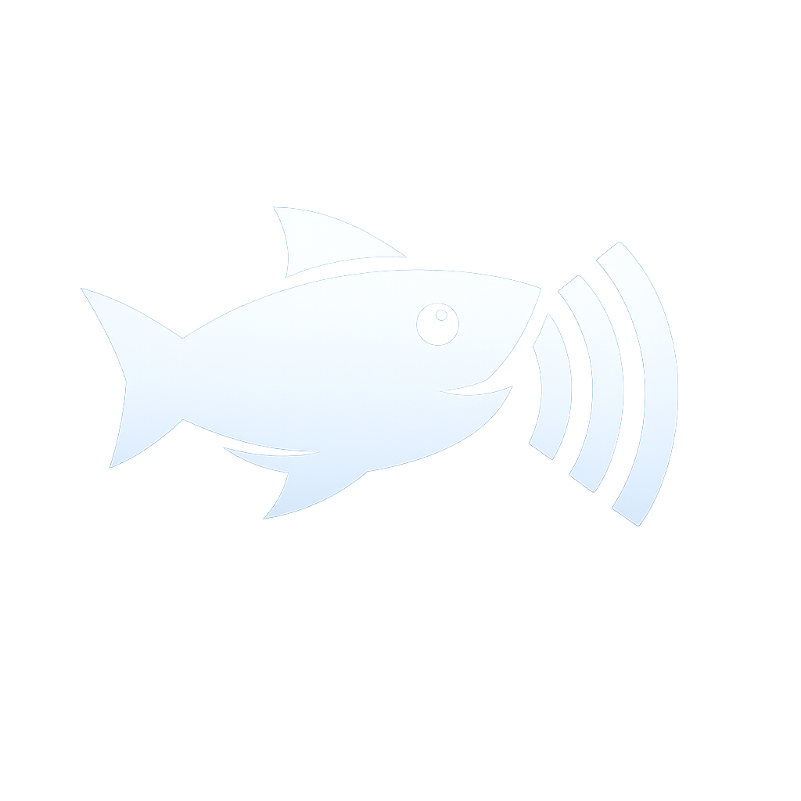

<p align="center">
  
</p>

<h1 align="center">fishpr</h1>

<p align="center">
  Push-to-talk dictation for KDE Plasma on Linux.<br>
  Hold <kbd>Ctrl</kbd>+<kbd>Space</kbd>, speak, release, and the text is typed where your cursor is.
</p>

---

## What it does

- **Hold to talk.** Hold <kbd>Ctrl</kbd>+<kbd>Space</kbd> anywhere. A small "Recording…" pill appears at the bottom of the screen. Let go and the transcription lands in the focused window about half a second later.
- **Or click the tray icon.** Click once to start, click again to stop. Tray and shortcut share one state, so you can start with one and stop with the other.
- **Pastes for you.** The text goes on the clipboard and is pasted into the focused app with <kbd>Ctrl</kbd>+<kbd>V</kbd>. If pasting fails, it's still on your clipboard.
- **Quiet when it works.** A notification appears only when something goes wrong.
- **Ignores silence.** A local voice check runs before any result is requested, so an accidental press with nobody speaking does nothing, instead of pasting a made-up "Thank you."

Tray icon states:

| Idle | Recording | Transcribing |
|:---:|:---:|:---:|
|  |  |  |

## How it works

When you release the key, the recording is checked locally for speech and, if someone spoke, uploaded to ChatGPT's anonymous dictation endpoint (the one behind the microphone button on chatgpt.com when you're logged out). No account or API key is needed.

```
pw-record ──WAV──▶ fishpr ── local VAD ── no speech? ──▶ drop recording
    │                          │
  mic                       speech ──▶ chatgpt.com/backend-anon/transcribe
                                              │
                                    text ──▶ clipboard + Ctrl+V
```

> [!WARNING]
> **This uses an unofficial, undocumented endpoint.** OpenAI can change or block it at any time without notice. Your audio is sent to OpenAI, so don't dictate anything you wouldn't type into ChatGPT.

## Requirements

- **KDE Plasma 6 on Wayland.** fishpr uses KDE's global-shortcut service and KWin's overlay (layer-shell) protocol. Clicking the tray icon also works on other desktops with a StatusNotifier tray.
- **Arch Linux on x86_64** for the one-line installer. On anything else, [build from source](#build-from-source).

## Install

```sh
curl -fsSL https://raw.githubusercontent.com/srafis/fishpr/main/install.sh | sh
```

This adds fishpr's signed pacman repo to `/etc/pacman.conf`, then installs the `fishpr-bin` package. The package brings in the dependencies (PipeWire, wl-clipboard, libnotify), installs the [uinput rule](#pasting) for silent pasting, and makes fishpr start on login. The installer then starts fishpr. It uses `pacman -Syu`, so it also upgrades the rest of your system.

If you installed fishpr by hand before, delete `~/.local/bin/fishpr` and `~/.config/autostart/fishpr.desktop`. The old autostart entry would otherwise override the packaged one.

### Updating

New versions arrive with your normal system upgrade (`sudo pacman -Syu` or `yay`). The running copy keeps its old version until you restart it: tray icon → **Quit**, then launch fishpr from the app menu. Or run the install command again, which updates and restarts it in one go.

### Uninstall

```sh
sudo pacman -R fishpr-bin
```

Then delete the `[fishpr]` section at the end of `/etc/pacman.conf`. The downloaded model and settings are in `~/.local/share/fishpr/`.

### Build from source

You need a Rust toolchain, plus **cmake** and **clang** to compile whisper.cpp, which provides the voice check.

```sh
sudo pacman -S --needed rust cmake clang pipewire-audio wl-clipboard libnotify
git clone https://github.com/srafis/fishpr && cd fishpr
cargo build --release
install -Dm755 target/release/fishpr ~/.local/bin/fishpr
```

The binary is self-contained, about 14 MB. To start it on login, copy [`packaging/fishpr.desktop`](packaging/fishpr.desktop) to `~/.config/autostart/` and change `Exec=` to the binary's full path. To start it now, without logging out:

```sh
systemd-run --user --unit=app-fishpr --collect ~/.local/bin/fishpr
```

For silent pasting, also install the [uinput rule](#pasting).

On first launch fishpr downloads the voice-activity model (Silero VAD, ~1 MB) to `~/.local/share/fishpr/`.

## Usage

| Do this | Get this |
|---|---|
| Hold <kbd>Ctrl</kbd>+<kbd>Space</kbd>, speak, release | Text pasted into the focused window |
| Click the tray icon, speak, click again | Same |
| Right-click the tray icon → **Quit** | fishpr exits and releases <kbd>Ctrl</kbd>+<kbd>Space</kbd> |

**Changing the shortcut:** <kbd>Ctrl</kbd>+<kbd>Space</kbd> is only the default. Rebind it in **System Settings → Keyboard → Shortcuts → fishpr → Push to talk (hold)**, and your choice is kept across restarts. While fishpr is running, KDE captures the combo, so apps no longer see it. In most IDEs <kbd>Ctrl</kbd>+<kbd>Space</kbd> is "trigger suggestions", so rebind it if you miss that.

## Pasting

fishpr pastes by pressing <kbd>Ctrl</kbd>+<kbd>V</kbd> on a virtual keyboard it creates through `/dev/uinput`. KWin doesn't let apps fake key presses any other way. This is silent and needs no permission prompt, as long as your user can write to `/dev/uinput`.

The `fishpr-bin` package installs a udev rule that grants this. KDE Connect ships the same rule. If you built from source and don't have KDE Connect, add the rule yourself:

```sh
sudo install -Dm644 packaging/60-fishpr-uinput.rules -t /etc/udev/rules.d/
```

Then log out and back in (or reboot).

Without uinput access, fishpr falls back to the desktop's RemoteDesktop portal. That works, but KDE asks for permission once and shows a "Remote control session started" notification on every paste.

**Terminals:** most terminals paste with <kbd>Ctrl</kbd>+<kbd>Shift</kbd>+<kbd>V</kbd>, so the automatic paste won't work there. The text is still on your clipboard.

## Troubleshooting

To see what fishpr is doing, run it in a terminal: `pkill fishpr; fishpr`. When started on login or with `systemd-run`, use `journalctl --user -u 'app-fishpr*' -f`.

| Symptom | Likely cause |
|---|---|
| "Transcription failed: HTTP 4xx/5xx" | The endpoint is rate-limiting or has changed. Try again in a bit. |
| "fishpr: Ctrl+Space unavailable" | Not running on KDE Plasma, or KWin's shortcut service isn't reachable. The tray icon still works. |
| "no speech detected" in the log | The voice check heard nobody. Check the mic in System Settings → Audio. |
| Pastes do nothing | Terminal (see above), or no `/dev/uinput` access and the portal permission was denied. |
| No tray icon | Your panel needs the System Tray widget. |

## Project layout

| File | What it does |
|---|---|
| [`src/main.rs`](src/main.rs) | Tray icon, event loop (click / shortcut / quit), state and icon animation |
| [`src/transcribe.rs`](src/transcribe.rs) | Client for the dictation endpoint and the local VAD check. This is the only file that knows about the backend. |
| [`src/recorder.rs`](src/recorder.rs) | Records the mic to a WAV via `pw-record` |
| [`src/shortcut.rs`](src/shortcut.rs) | <kbd>Ctrl</kbd>+<kbd>Space</kbd> via KGlobalAccel (press *and* release) |
| [`src/hud.rs`](src/hud.rs) | The "Recording…" overlay (wlr-layer-shell, software-rendered) |
| [`src/paste.rs`](src/paste.rs) | Ctrl+V via uinput, with the portal fallback |
| [`src/desktop.rs`](src/desktop.rs) | Clipboard and notifications |

| [`install.sh`](install.sh) | The one-line installer: adds the pacman repo, installs, starts |
| [`packaging/`](packaging/) | `fishpr-bin` PKGBUILD, desktop entry, uinput udev rule |
| [`.github/workflows/release.yml`](.github/workflows/release.yml) | Builds, signs, and publishes a release when a `v*` tag is pushed |

To switch transcription backends (for example to the official OpenAI API), replace `Transcriber::begin` / `Session::finish` in `transcribe.rs`. Nothing else needs to change.

Run the tests with `cargo test`.

## Releasing

Releases are built by CI. The pacman repo lives in the assets of the GitHub release tagged `repo`: the package, its database, and the public signing key that `install.sh` imports.

**One-time setup:** create a signing key without a passphrase and store it as a repo secret. Keep a backup of the key somewhere safe.

```sh
gpg --batch --passphrase '' --quick-gen-key "fishpr package signing" ed25519 sign never
gpg --armor --export-secret-keys "fishpr package signing" | gh secret set GPG_PRIVATE_KEY
```

**Each release:** bump `version` in `Cargo.toml`, commit, then tag and push:

```sh
git tag v0.2.0 && git push origin main v0.2.0
```

The tag must match `Cargo.toml`, or the workflow stops. Users get the new version on their next `pacman -Syu`.

## Credits

- Voice activity detection: [Silero VAD](https://github.com/snakers4/silero-vad), run through [whisper.cpp](https://github.com/ggml-org/whisper.cpp) / [whisper-rs](https://codeberg.org/tazz4843/whisper-rs).
- HUD font: [Noto Sans](https://notofonts.github.io/), SIL Open Font License 1.1 ([`assets/NotoSans-OFL.txt`](assets/NotoSans-OFL.txt)).

## License

[MIT](LICENSE). The bundled Noto Sans font is under the SIL Open Font License 1.1.
